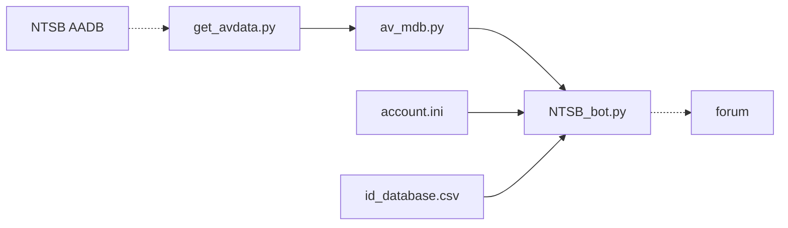

    
# NTSB Bot

  

Produces markdown reports from the NTSB aviation accident database and uploads them to Reddit
    

# File Descriptions
* :file_folder: **Aviation_Data:** stores that months aviation data
* 📃 **get_avdata.py:** downloads the latest NTSB aviation accident database
* 📃 **av_mdb.py:** reads the relevent data and creates the formatted reports to submit
* 📃 **NTSB_bot.py:** submits the reports generated by av_mdb.py
    * :page_facing_up: **account.ini:** stores the login info for the bot
    * :page_facing_up: **id_database.csv:** stores the incident IDs so the program knows what it's already uploaded

# Example Output

   ### get_avdata.py
   

