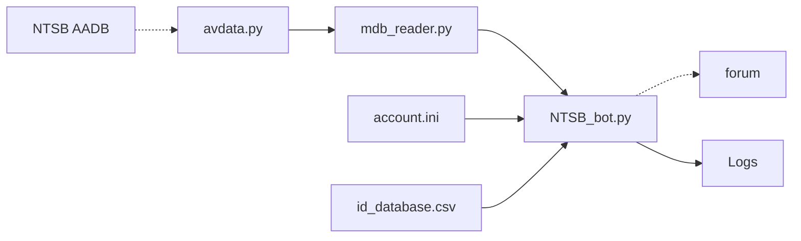

    
# NTSB Bot

  

Produces markdown reports from the NTSB aviation accident database and uploads them to Reddit
    
[File Descriptions](#file-descriptions) •
[Images](#images)
    

# File Descriptions
* :file_folder: **Logs:** stores the logs from past submissions
* :file_folder: **Aviation_Data:** stores that months aviation data
    * :page_facing_up: **id_database.csv:** stores the incident IDs so the program knows what it's already uploaded
* :page_facing_up: **account.ini:** stores the login info for the bot
* 💾 **avdata.py:** downloads the latest NTSB aviation accident database
* 💾 **mdb_reader.py:** reads the relevent mdb files and creates the formatted reports to submit
* 💾 **NTSB_bot.py:** submits the reports generated by mdb_reader.py 

# Images

  

